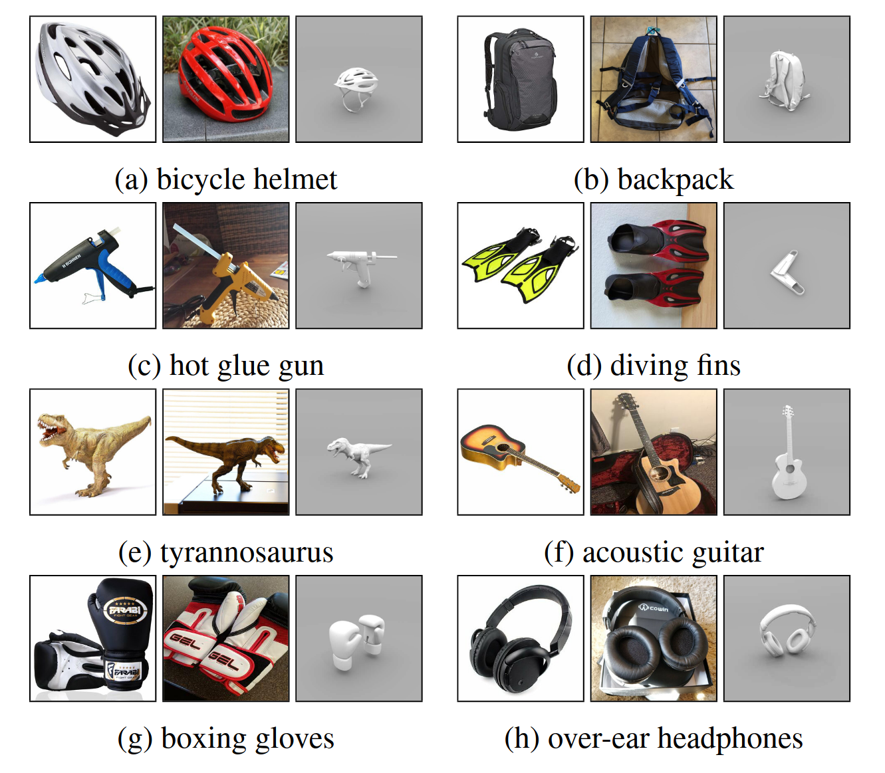

# Datasets
## Adaptiope

Our proposed **Adaptiope** dataset for unsupervised domain adaptation with 123 classes in the 3 domains Product, Real Life and Synthetic. Every class contains 100 images per domain for a total of 36.900 images. 

[Adaptiope download link](https://drive.google.com/file/d/1FmdsvetC0oVyrFJ9ER7fcN-cXPOWx2gq/view?usp=sharing)  
SHA256 checksum: 93378c8d5f89ebd7f2015d38ba8d3e48c00bae959ebeeaf822e79e6fcfc7fd67

<p align="center">
  
</p>

## Modern Office-31

Our proposed **Modern Office-31** dataset with our refurbished Amazon domain and an additional synthetic domain.
Note that this download also contains the original Office-31 DSLR domain for a total of 7.210 images. The setup in our paper only used the Amazon, Synthetic and Webcam domains with a total of 6.712 files. However, the additional domain can be used to reproduce our **Refurbished Office-31** experiments with domains Amazon, DSLR and Webcam.

[Modern Office-31 download link](https://drive.google.com/file/d/1p7ecv9kP3YbmdiY49vSjTaG0Aw51n26x/view?usp=sharing)  
SHA256 checksum: da02da26ec456def6af39d32c794070cb51a3b5696489172f70f69f2da2f1a63

## Refurbished Office-31
If you want to reproduce our **Refurbished Office-31** experiments you can construct the dataset from the Amazon, DSLR and Webcam domains provided in the Modern Office-31 dataset above.


# External Code

For our experiments, we used the official implementations of [RSDA](https://github.com/XJTU-XGU/RSDA), [SymNet](https://github.com/YBZh/SymNets) and [CAN](https://github.com/kgl-prml/Contrastive-Adaptation-Network-for-Unsupervised-Domain-Adaptation).


# Citation

If you use our datasets, please consider citing our [paper](https://openaccess.thecvf.com/content/WACV2021/html/Ringwald_Adaptiope_A_Modern_Benchmark_for_Unsupervised_Domain_Adaptation_WACV_2021_paper.html) ([PDF](https://openaccess.thecvf.com/content/WACV2021/papers/Ringwald_Adaptiope_A_Modern_Benchmark_for_Unsupervised_Domain_Adaptation_WACV_2021_paper.pdf)):

```
@InProceedings{Ringwald_2021_WACV,
    author    = {Ringwald, Tobias and Stiefelhagen, Rainer},
    title     = {Adaptiope: A Modern Benchmark for Unsupervised Domain Adaptation},
    booktitle = {Proceedings of the IEEE/CVF Winter Conference on Applications of Computer Vision (WACV)},
    month     = {January},
    year      = {2021},
    pages     = {101-110}
}
```
